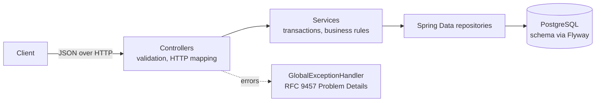
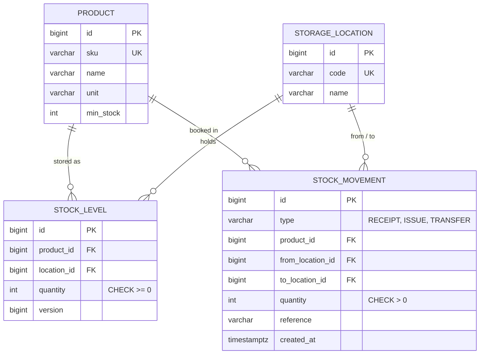

# Inventory API


A REST backend for warehouse inventory management: product master data, storage locations,
goods receipts, goods issues, transfers between locations and a low-stock report.

**Stack:** Java 21 · Spring Boot 3.5 · Spring Data JPA / Hibernate · PostgreSQL 16 · Flyway ·
Bean Validation · springdoc OpenAPI · JUnit 5 · Mockito · Testcontainers · Docker · GitHub Actions

## Why this project

During my dual study programme I worked in an SAP team and built interfaces and a logistics
Fiori app on top of SAP's inventory management. This project rebuilds the core of that domain
as a standalone backend, to show how I design one without an ERP system underneath:
consistent bookings, clear error handling, a real database schema and automated tests.

## Features

| Area | Endpoints |
| --- | --- |
| Products | `POST /api/products` · `GET /api/products?q=` (paged, search by SKU or name) · `GET /api/products/{id}` · `PUT /api/products/{id}` |
| Storage locations | `POST /api/locations` · `GET /api/locations` · `GET /api/locations/{id}` |
| Goods movements | `POST /api/movements/receipts` · `POST /api/movements/issues` · `POST /api/movements/transfers` · `GET /api/movements?productId=` (history, newest first) |
| Stock | `GET /api/stock?productId=` · `GET /api/stock?locationId=` · `GET /api/stock/low` (below reorder point) |

Interactive API documentation is available at `/swagger-ui.html` once the application is running.

**Business rules**

- Stock can never become negative. A goods issue or transfer that asks for more than is available
  is rejected with `409 Conflict`, including how much is available.
- Every booking is one database transaction: stock change and journal entry are written together or not at all.
- Movements are an append-only journal. They are never updated or deleted, so every stock level can be traced back.
- SKUs and location codes are unique business keys, normalised to upper case, and cannot be changed.
- A transfer needs two different locations (`422 Unprocessable Entity` otherwise).

## Architecture



The code is organised by feature (`product`, `location`, `movement`, `stock`), each with its
entity, repository, service, DTOs and controller. Entities are never exposed through the API;
requests and responses are Java records.



## Design decisions

**Preventing overselling under concurrency.** Two goods issues that run at the same time could
both read "5 in stock" and both take 5. Each booking therefore loads the stock row with
`SELECT ... FOR UPDATE` (`@Lock(PESSIMISTIC_WRITE)`), so bookings on the same product and location
run one after another. `ConcurrentIssueTest` fires 8 parallel issues against 5 units and checks
that exactly 5 succeed and the stock ends at 0. A database `CHECK (quantity >= 0)` is the last line of defence.

**No deadlocks on transfers.** A transfer locks two rows. If one transfer A→B and another B→A
locked them in opposite order, each could wait for the other forever. Transfers always lock the
location with the lower id first.

**Rules live in the domain object.** The quantity of a `StockLevel` can only change through
`increase()` and `decrease()`, so "never negative" is enforced in one place and unit-tested
without Spring or a database.

**Schema owned by Flyway, verified by Hibernate.** The schema comes from versioned SQL migrations;
Hibernate only validates that the entities match (`ddl-auto: validate`).

**Uniform errors.** All errors follow RFC 9457 Problem Details, for example:

```json
{
  "type": "about:blank",
  "title": "Insufficient stock",
  "status": 409,
  "detail": "Insufficient stock: requested 200, available 170",
  "instance": "/api/movements/issues",
  "available": 170,
  "requested": 200
}
```

**Tests against a real database.** Integration tests run against PostgreSQL in Docker via
Testcontainers instead of an in-memory database, so the migrations, constraints and row locks
are tested exactly as they behave in production.

## Running it

**With Docker only** (no local Java needed):

```bash
docker compose up --build
```

The API runs on http://localhost:8080, Swagger UI on http://localhost:8080/swagger-ui.html.
Then try the scripted warehouse scenario:

```bash
./scripts/demo.sh
```

**From the IDE / command line** (Java 21 and Maven):

```bash
docker compose up -d db
mvn spring-boot:run
```

## Example

```bash
# Create a product with a reorder point of 100 pieces
curl -X POST localhost:8080/api/products -H 'Content-Type: application/json' \
  -d '{"sku":"BOLT-M8","name":"Hex bolt M8x40","unit":"PCS","minStock":100}'

# Book a goods receipt of 250 pieces into location 1
curl -X POST localhost:8080/api/movements/receipts -H 'Content-Type: application/json' \
  -d '{"productId":1,"locationId":1,"quantity":250,"reference":"PO-4711"}'

# Current stock per location
curl 'localhost:8080/api/stock?productId=1'
```

## Tests

```bash
mvn verify   # needs a running Docker daemon for Testcontainers
```

| Test | What it covers |
| --- | --- |
| `StockLevelTest` | Domain rules of a stock level (unit test) |
| `MovementServiceTest` | Booking logic with mocked repositories (unit test, Mockito) |
| `InventoryApiIntegrationTest` | Full HTTP flows, validation, error codes, low-stock report against PostgreSQL |
| `ConcurrentIssueTest` | 8 parallel goods issues against 5 units in stock |

GitHub Actions runs all tests and builds the Docker image on every push.

## Possible next steps

- Authentication and roles (Spring Security, e.g. read-only vs. warehouse staff)
- Reservations for open orders, so available stock = on hand − reserved
- Batch and serial number tracking
- Publishing low-stock events to a message broker instead of polling the report

## Author

Marlon Brunner · B.Sc. Business Information Systems (Wirtschaftsinformatik), DHBW Ravensburg
